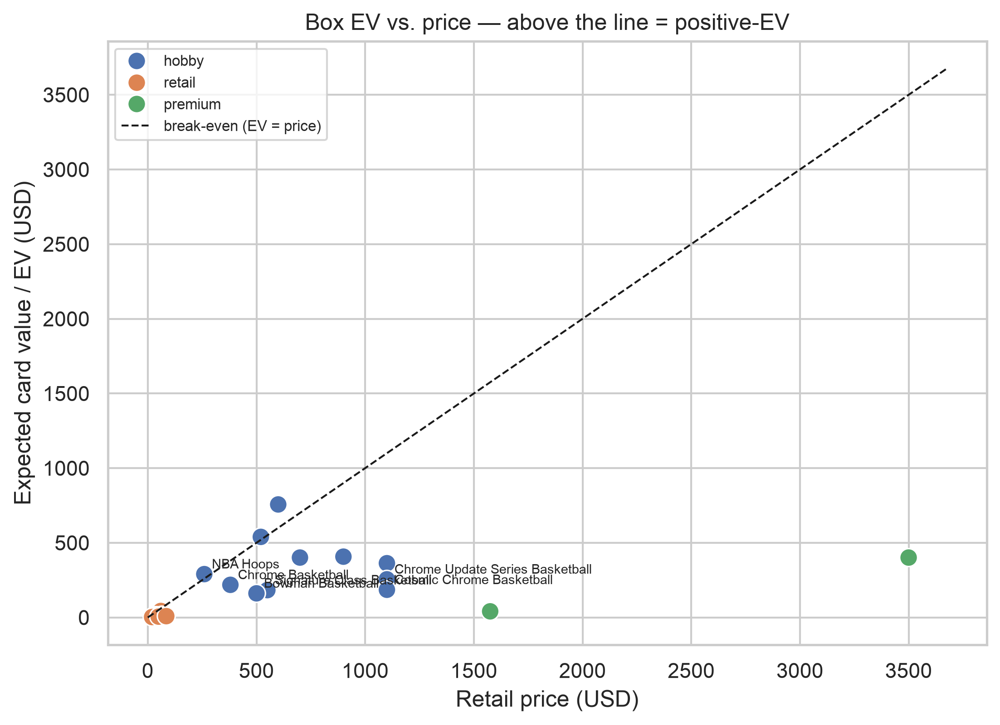
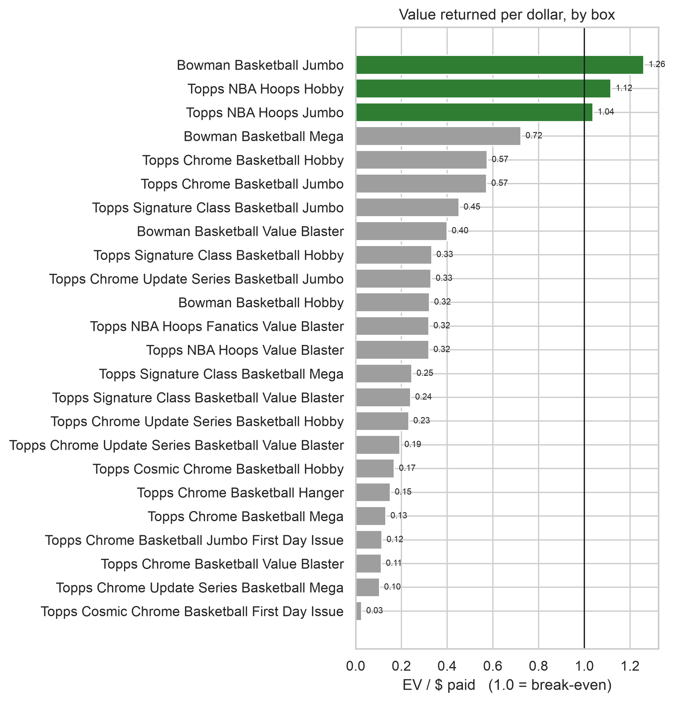
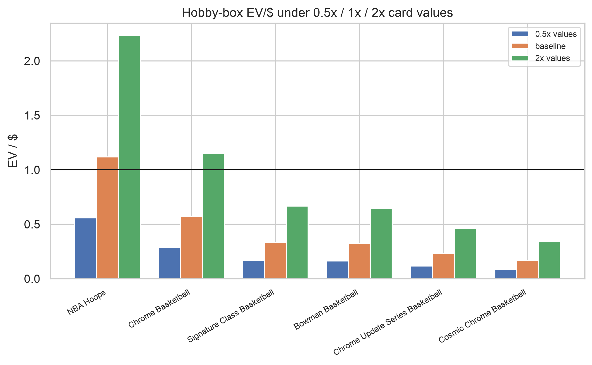

# Hobby Box EV — Stakeholder Report

**To:** hobby-box collector deciding whether to buy a sealed box
**From:** EV Calculator project
**Date:** 2026-08-28
**Prices as of:** 2026-08-28 (blowoutcards street price / Topps SRP)

---

## 1. Bottom line

> **At today's prices, only one of the six sealed hobby boxes is a positive-EV buy —
> 2025-26 Topps NBA Hoops Hobby (≈ $260, expected card value ≈ $290).**
> The two most-hyped premium boxes, Chrome Update Series and Cosmic Chrome Hobby
> (both ≈ $1,100), return roughly **$0.20 of expected card value per $1 paid** — you are
> buying the chase-card lottery ticket, not the expected contents.

The buy/pass **ranking is robust**: halving or doubling our card-value estimates does not
flip a single verdict, and how we handle missing pull-odds does not move the model.

## 2. Problem & method

**Decision:** should the collector pay price *P* for a specific sealed box?
**Answer:** compare *P* to **EV** — the probability-weighted resale value of the cards inside.

```
EV_box  =  Σ over card tiers [ (packs_per_box / pull_odds) × tier_value ]  +  base cards × $0.20
EV / $  =  EV_box / price          (> 1 = good bet over many boxes;  < 1 = pay-to-play)
```

- **Pull odds** come from Topps / checklistinsider odds sheets (`data/raw/card_tiers.csv`).
- **Tier values** are a placeholder ladder (`rough_estimate_v0`) calibrated to the six
  real eBay sold comps collected so far (Alter Egos / Minions).
- Hobby boxes use the full per-tier ladder; other formats use a floor estimate
  (autographs + SSP inserts + base only — the parallel rainbow is not yet transcribed).
- Implementation: `src/ev.py`; full table `data/processed/ev_report.csv`.

## 3. Results

### 3.1 EV vs. price — the buy/pass picture


Points above the dashed break-even line are positive-EV. Among hobby boxes only **NBA
Hoops Hobby** clears it. Bowman Jumbo and Hoops Jumbo are marginal (EV/$ ≈ 1.0–1.3) and
are lower-bound estimates.

### 3.2 Value returned per dollar


| box | price | EV | EV/$ | verdict |
|---|---|---|---|---|
| NBA Hoops Hobby | $260 | $290 | **1.12** | buy |
| Chrome Basketball Hobby | $380 | $219 | 0.58 | pass (EV) |
| Signature Class Hobby | $550 | $183 | 0.33 | pass (EV) |
| Bowman Basketball Hobby | $500 | $162 | 0.32 | pass (EV) |
| Chrome Update Series Hobby | $1,100 | $255 | 0.23 | pass (EV) |
| Cosmic Chrome Hobby | $1,100 | $185 | 0.17 | pass (EV) |
| Chrome Jumbo *First Day Issue* | $3,500 | $401 | 0.11 | avoid |

### 3.3 Sensitivity — does the verdict survive our biggest assumption?


Re-pricing the six hobby boxes at **0.5× / 1× / 2×** our card-value estimates:

| box | EV/$ @0.5× | EV/$ baseline | EV/$ @2× |
|---|---|---|---|
| NBA Hoops | 0.56 | 1.12 | 2.23 |
| Chrome Basketball | 0.29 | 0.57 | 1.15 |
| Signature Class | 0.17 | 0.33 | 0.67 |
| Bowman | 0.16 | 0.32 | 0.65 |
| Chrome Update Series | 0.12 | 0.23 | 0.46 |
| Cosmic Chrome | 0.08 | 0.17 | 0.34 |

**No verdict flips.** Every premium box stays "pass" even at 2×; NBA Hoops stays "buy"
even at 0.5×. Chrome Basketball Hobby only becomes marginal (1.15) at 2×.

## 4. Assumptions & Risks

| assumption | baseline | alternate tested | effect on the decision |
|---|---|---|---|
| Card values = `rough_estimate_v0` ladder (6 real comps) | EV as reported | ×0.5 / ×2 | **ranking robust**; absolute EV is indicative, not precise |
| Missing pull-odds → column-mean impute | slope 0.669 | median / drop (`scenario_results.csv`) | slope 0.669 / 0.670 / 0.669 — **no change** |
| EV is a *mean*; box outcomes are right-skewed | report EV | report median / `P(beat price)` | **most boxes return below EV** — only buy when EV/$ is comfortably > 1 |
| Non-Hobby EV omits the parallel rainbow | autos + SSP + base | full tier ladder (not transcribed) | non-Hobby EV/$ shown are **lower bounds** |
| Prices are one snapshot (2026-08-28) | Blowout / SRP | live market feed | hot-box prices move weekly — **re-run before acting** |
| Selling costs | ignored | ~13% eBay/PayPal fees | subtract before treating any EV/$ ≈ 1 as profit |

## 5. Decision implications & next steps

**For the collector**
- **Buy:** NBA Hoops Hobby at/under ~$260 — the only sealed box that clears break-even on expected contents.
- **Pass (as an EV play):** Chrome Update, Cosmic Chrome, Signature Class, Bowman, Chrome Basketball — all return < $0.60 per $1. Buy only for the rip or a specific chase, eyes open.
- **Avoid on EV:** retail Blaster / Mega / Hanger, and the Chrome Jumbo First Day Issue ($3,500, EV/$ ≈ 0.11).

**For the tool**
1. Replace the placeholder ladder with real eBay sold-comp medians — start with autographs and low-numbered parallels.
2. Transcribe per-format tier odds so non-Hobby EV is a real estimate, not a floor.
3. Weekly price refresh so `EV/$` tracks the live market.
4. Report `P(box beats price)` and the median outcome next to EV — the mean hides the right-skew.

---
*Reproduce: `python src/ev.py` (table) · `notebooks/homework12_results-reporting-delivery-design_submission.ipynb` (charts) · Stage 11 sensitivity in `notebooks/homework11_...ipynb`.*
